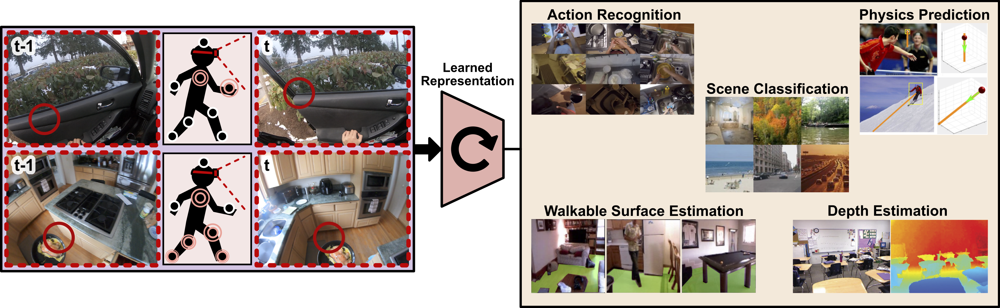
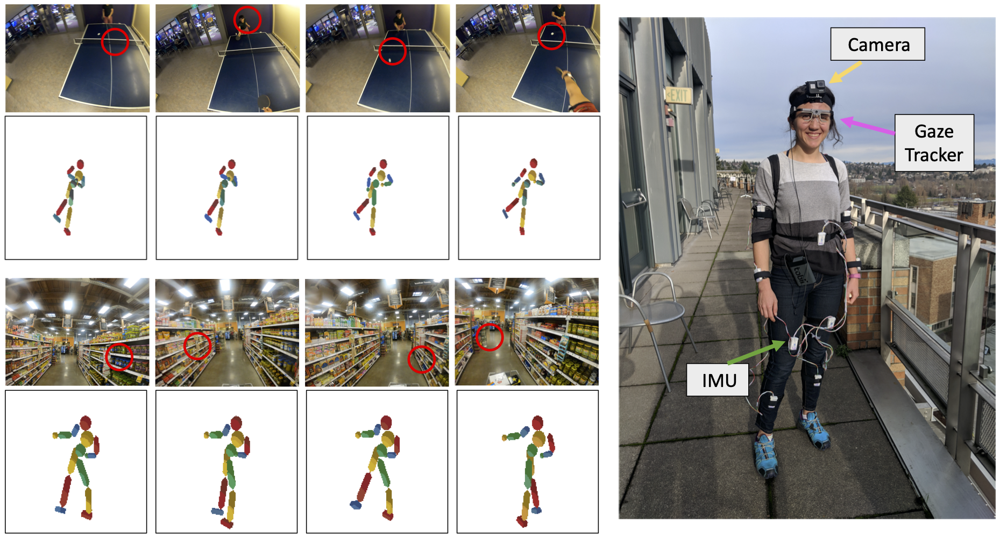

# [What Can You Learn from Your Muscles?</br> Learning Visual Representation from Human Interactions](https://arxiv.org/pdf/2010.08539.pdf)
## K Ehsani, D Gordon, T Nguyen, R Mottaghi, A Farhadi
#### Published at ICLR 2021

[(Project Page)](https://github.com/ehsanik/muscleTorch) [(PDF)](https://arxiv.org/pdf/2010.08539.pdf) [(Slides)](https://drive.google.com/file/d/1PwUr84_K1p6aIeuEkpkunvTsyimWtAJg/view?usp=sharing) [(Video)](https://drive.google.com/file/d/1_CxQiQvuq8HFcFGOwdK16GvGEp-wz5aO/view?usp=sharing) [(Presentation)](https://drive.google.com/file/d/1WE3qxjlwQ23NTlya9HLfv9WYz27sd3Ld/view?usp=sharing)

<div style="text-align: center;"></div>

### Abstract

Learning effective representations of visual data that generalize to a variety of downstream tasks has been a long quest for computer vision. Most representation learning approaches rely solely on visual data such as images or videos. In this paper, we explore a novel approach, where we use human interaction and attention cues to investigate whether we can learn better representations compared to visual-only representations. For this study, we collect a dataset of human interactions capturing <b>body part movements</b> and <b>gaze</b> in their daily lives. Our experiments show that our self-supervised representation that encodes interaction and attention cues outperforms a visual-only state-of-the-art method [MoCo](https://arxiv.org/abs/1911.05722), on a variety of target tasks: 
    <ol>
    <li> [Scene classification (semantic)](https://vision.cs.princeton.edu/projects/2010/SUN/)
    <li> [Action recognition (temporal)](https://epic-kitchens.github.io/2020-100)
    <li> [Depth estimation (geometric)](https://cs.nyu.edu/~silberman/datasets/nyu_depth_v2.html)
    <li> [Dynamics prediction (physics)](https://github.com/allenai/newtonian)
    <li> [Walkable surface estimation (affordance)](http://roozbehm.info/papers/Mottaghi16cvpr_b-sm.pdf)
    </ol>


### Installation

1. Clone the repository using the command:

```
git clone https://github.com/ehsanik/muscleTorch
cd muscleTorch
```

2. Install requirements:

```
pip3 install -r requirements.txt
```


3. Download the images from [here](https://drive.google.com/file/d/1znyScxE50y9UpoVfKRHCBFyxYeoNd4rM/view?usp=sharing) and extract it to HumanDataset/images.
4. Download the sensor data from [here](https://drive.google.com/file/d/1dLTpGhOlWJ6TctVe2iWLIGg2M7TkiBSq/view?usp=sharing) and extract it to HumanDataset/annotation_h5.
5. Download pretrained weights from [here](https://drive.google.com/file/d/1IStOGhi8Qq_-5J2MH5MpCqeVyBTecNVs/view?usp=sharing) for reproducing the numbers in the paper, extract it to HumanDataset/saved_weights. 


### Dataset

We introduce a new dataset of human interactions for our representation learning framework. We record egocentric videos from a GoPro camera attached to the subjects' forehead. We simultaneously capture body movements, as well as the gaze. We use Tobii Pro2 eye-tracking to track the center of the gaze in the camera frame. We record the body part movements using BNO055 Inertial Measurement Units (IMUs) in 10 different locations (torso, neck, 2 triceps, 2 forearms, 2 thighs, and 2 legs). 

<div style="text-align: center;"></div>


The structure of the dataset is as follows:

```
HumanDataset
└── images
│   └── <video_stamp>
│       └── images_<video_stamp>_<INDEX>.jpg
└── annotation_h5
│   ├── [test/train]_<feature_name>.h5
│   ├── [test/train]_image_name.json
│   ├── [test/train]_h5pyind_2_frameind.json
│   └── [test/train]_timestamp.json
└── saved_weights
    ├── trained_representations
    |   └── <Learned_Representations>.pytar
    └── trained_end_tasks
        ├── Action_Recognition
        ├── Depth_Estimation
        ├── Dynamic_Prediction
        ├── Scene_Classification
        └── Walkable_Surface_Estimation
            └── <Trained_End_Tasks_Weights>.pytar

```
### Training

To train your own model:

```
python3 main.py --gpu-ids 0 --arch MoCoGazeIMUModel --input_length 5 --sequence_length 5 --output_length 5 \
--dataset HumanContrastiveCombinedDataset --workers 20 --num_classes -1 --loss MoCoGazeIMULoss \
--num_imus 6 --imu_names neck body llegu rlegu larmu rarmu \
--input_feature_type gaze_points move_label --base-lr 0.0005 --dropout 0.5 --data PATHTODATA/human_data 
```

See `scripts/training_representation.sh` for additional training scripts.

### End-task fineTuning and testing

To test using the pretrained model and reproduce the results in the paper refer to `scripts/end_task_representation.sh`.


### Citation

If you find this project useful in your research, please consider citing:

```
   @article{ehsani2020learning,
     title={Learning Visual Representation from Human Interactions},
     author={Ehsani, Kiana and Gordon, Daniel and Nguyen, Thomas and Mottaghi, Roozbeh and Farhadi, Ali},
     journal={International Conference on Learning Representations},
     year={2021}
   }
```
